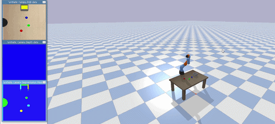

# Vision-Guided Robotic Arm Simulation

A Python-based robotics simulation featuring a vision-guided pick and place system built with PyBullet and OpenCV.

## Project Overview
This project simulates a 7-DOF Kuka robotic arm that uses an overhead camera and computer vision to detect coloured objects and perform autonomous pick and place operations.

## Features
- Real-time physics simulation using PyBullet
- Inverse kinematics solver for precise end-effector positioning
- Overhead camera simulation with OpenCV colour detection
- Pixel to world coordinate transformation
- State machine architecture for autonomous operation
- Simulated gripper using physics constraints

## Tech Stack
- Python 3.11
- PyBullet (physics simulation)
- OpenCV (computer vision)
- NumPy (linear algebra and array operations)

## How It Works
1. A simulated overhead camera captures the scene
2. OpenCV detects coloured spheres using HSV colour masking
3. Pixel coordinates are converted to 3D world coordinates
4. Inverse kinematics calculates joint angles to reach each target
5. The arm moves through a state machine: DETECT > HOVER > DESCEND > GRAB > LIFT > PLACE > RELEASE

## Setup
git clone https://github.com/Liam-DillonQUT/Vision-guided-robot-arm.git
cd Vision-guided-robot-arm
python -m venv venv
venv\Scripts\Activate.ps1
pip install pybullet opencv-python numpy
python Robot_arm.py

## Background
Built as a portfolio project to demonstrate robotics software skills alongside a Mechatronics Engineering degree.
